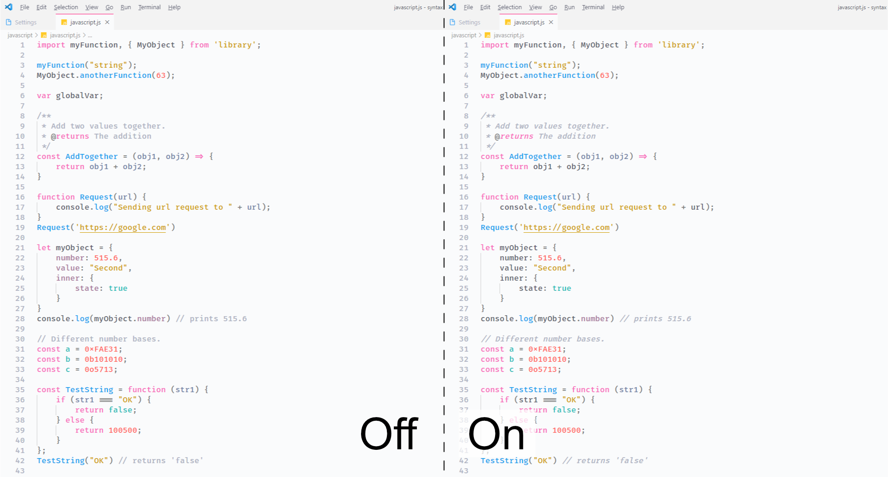
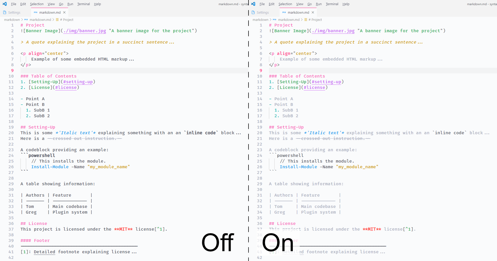
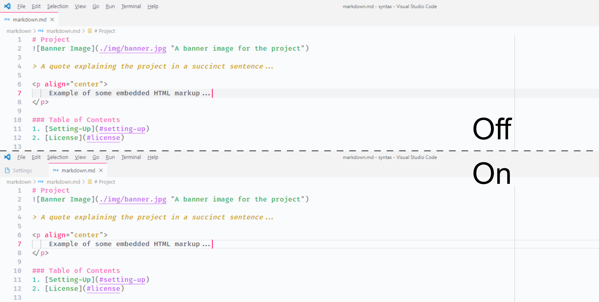
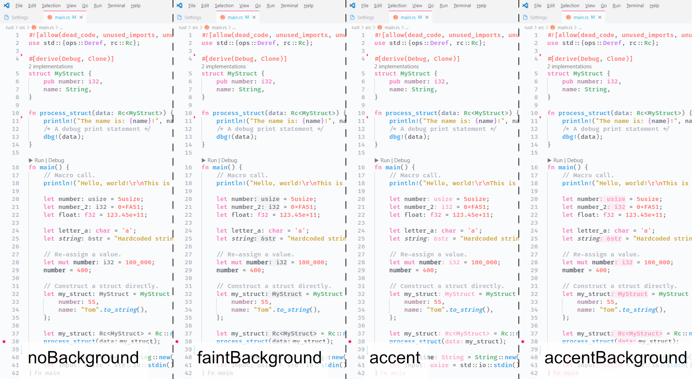
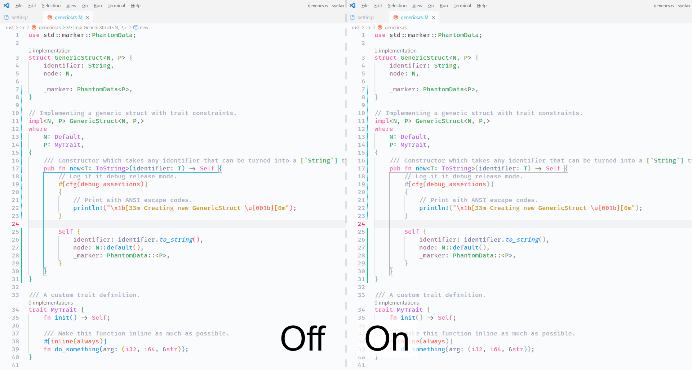
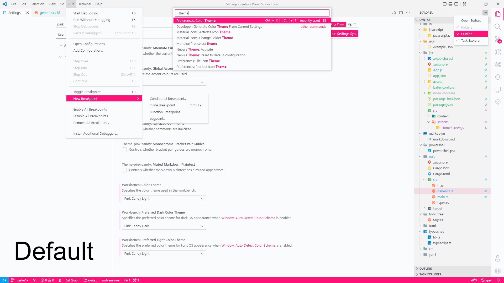
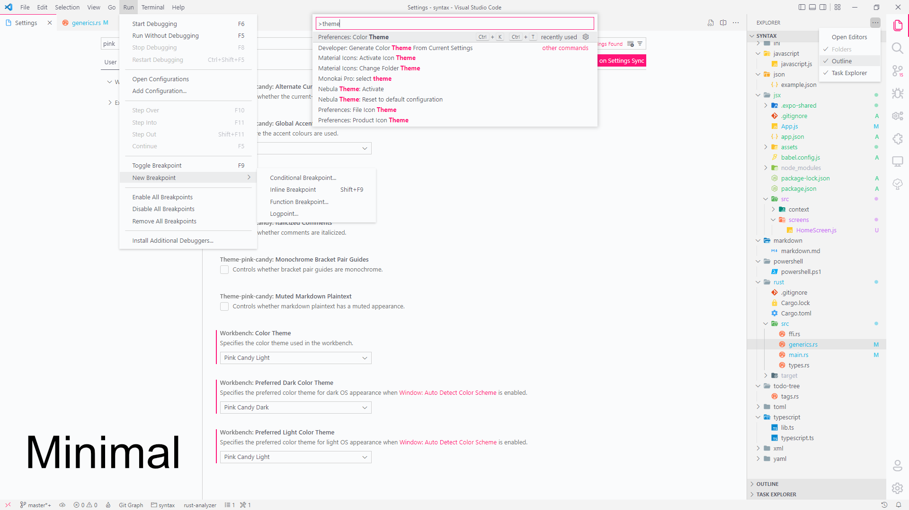

# Configuration
The theme has a number of configuration options. The illustrations below present these in the light theme, but this applies to the dark them too.

### Italicized Comments
Controls whether comments are italicized.

### Muted Markdown Plaintext
Controls whether markdown plaintext has a muted appearance, i.e. a reduced contrast between the text and the background.

### Alternate Current-Line Style
Controls whether the current-line uses an alternate appearance, i.e. outlined border instead of filled in.

### Inlay Hint Styles
Controls the appearance of inlay hints.

### Monochrome Bracket Pair Guides
Controls whether bracket pair guides are monochrome.

### Accent Colour Usage
Controls where the accent colours are used.

