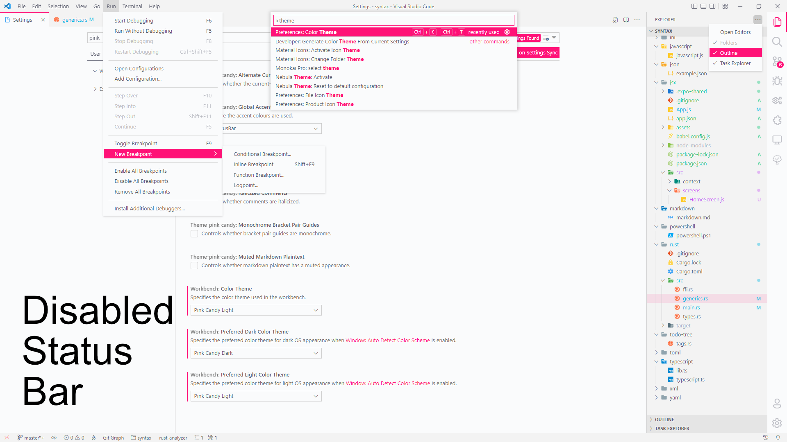

# Configuration
The theme has a number of configuration options. The illustrations below present these in the light theme, but this applies to the dark theme too.

⚠ *Note:* Because of a limitation of VS Code, the window must be reloaded in order to see the effects of changing the settings below. A notification will pop-up whenever a change is detected to prompt you.

### Italicized Comments
Controls whether comments are italicized.

---

### Markdown Syntax Style
Controls the syntax colour scheme for markdown.

---

### Alternate Current-Line Style
Controls whether the current-line uses an alternate appearance, i.e. outlined border instead of filled in.

---

### Inlay Hint Styles
Controls the appearance of inlay hints.

---

### Monochrome Bracket Pair Guides
Controls whether bracket pair guides are monochrome.

---

### Light Terminal Colour Scheme
Controls the terminal colour scheme.

---

### Accent Colour Usage
Controls where the accent colours are used.

