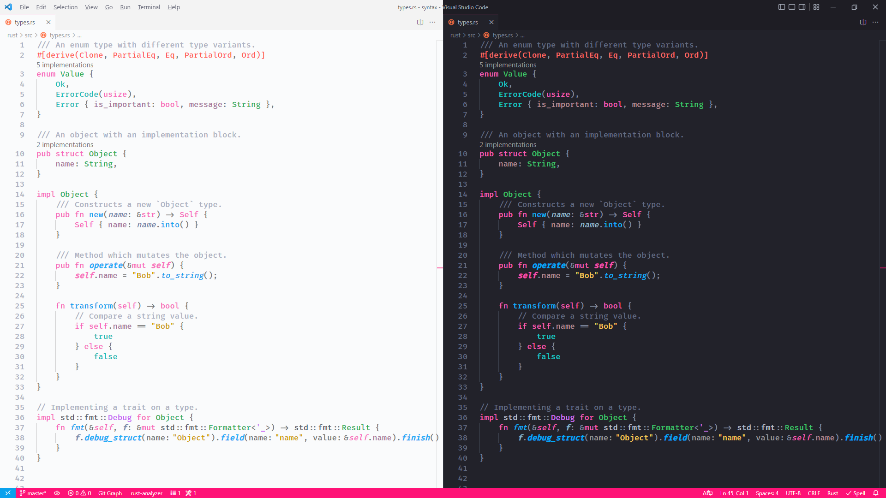
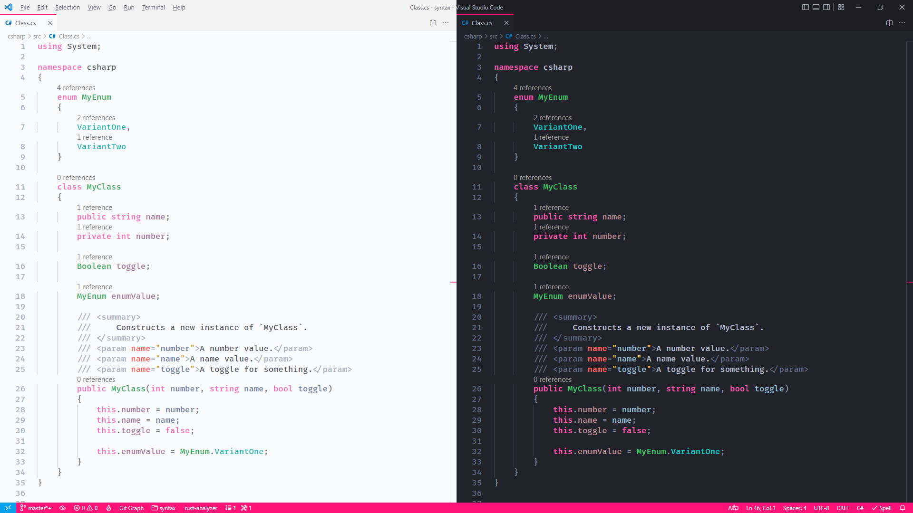
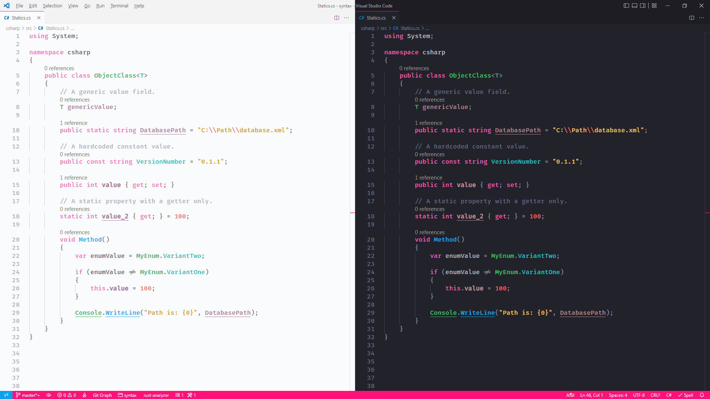
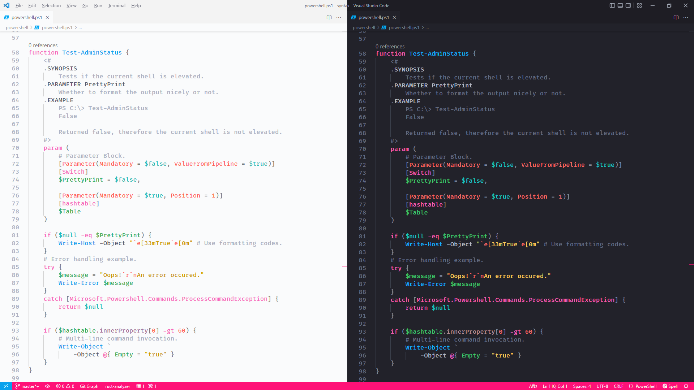
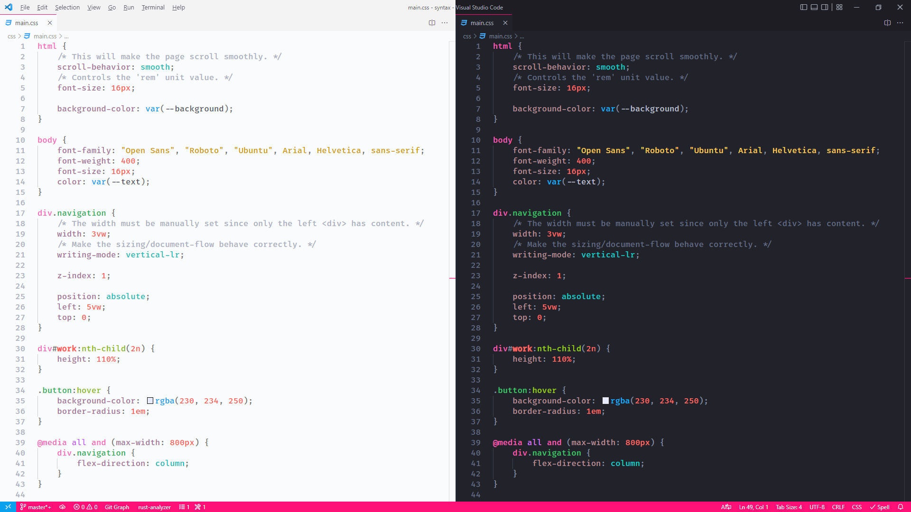
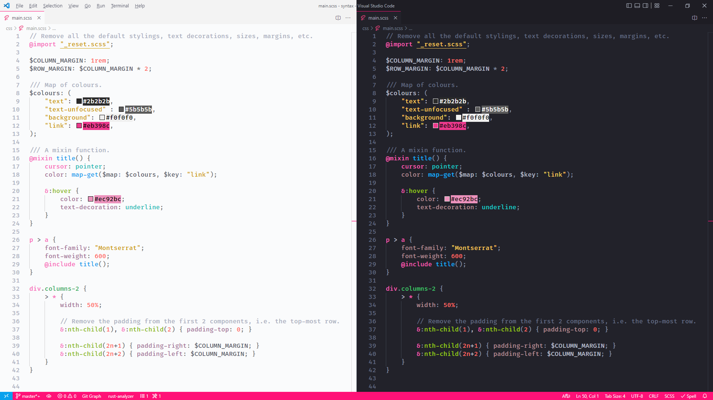
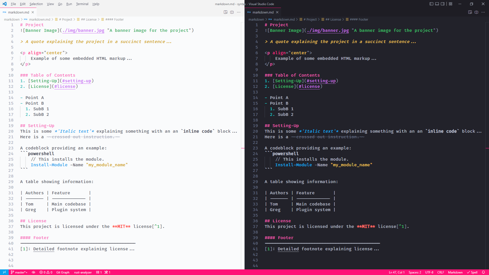

# Syntax Highlighting Examples
Screenshots of syntax highlighting in a selection of languages, with light and dark themes side-by-side.

### Table of Contents
1. [Rust](#rust)
2. [C#](#c#)
3. [Powershell](#powershell)
4. [HTML/CSS/SCSS](#html/css/scss)
5. [Javascript](#javascript)
   1. [JSX](#jsx)
6. [Markdown](#markdown)
7. [Json](#json)

## Rust
Using the [Rust Analyzer](https://marketplace.visualstudio.com/items?itemName=matklad.rust-analyzer) extension with semantic highlighting enabled.

## C#
Using the official [C#](https://marketplace.visualstudio.com/items?itemName=ms-dotnettools.csharp) extension with semantic highlighting enabled.

## Powershell
Using the official [Powershell](https://marketplace.visualstudio.com/items?itemName=ms-vscode.PowerShell) extension.

## HTML/CSS/SCSS
Using the built-in HTML/CSS/SCSS language extensions.

## Javascript
Using the built-in Javascript language extension with semantic highlighting enabled.

### JSX
Using the built-in Javascript language extension with semantic highlighting enabled.

## Markdown
Using the built-in Markdown language extension along with the [Markdown All in One](https://marketplace.visualstudio.com/items?itemName=yzhang.markdown-all-in-one) extension.

## Json
Using the built-in Json language extension.

