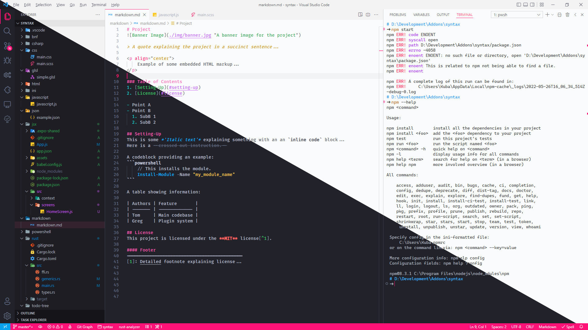

 

A vivid colour scheme with a pink accent, in both light and dark variants. Includes editor/syntax highlighting as well as full IDE and workbench theming.

 

⭐ <i>New:</i> The theme now has built-in configuration options allowing you to tweak certain aspects of the theme to your liking in an easy-to-use manner. See <a href="#configuration-options">Configuration Options</a> for more details.

 

### Table of Contents
1. [Screenshots](#screenshots)
2. [Overview](#overview)
3. [Language Specific Styles](#language-specific-styles)
4. [Configuration Options](#configuration-options)
5. [Overriding Syntax Styles](#overriding-syntax-styles)
6. [Contributing](#contributing)
7. [License](#license)

## Screenshots

> Editing a markdown file.

> Debugging an application.

> Configuring some settings.

> Viewing a git diff.

## Overview
This theme supports both *'Semantic'* and *'Textmate'* highlighting, so it should work well with any langauge extension. More specifically however, this theme has been hand-tweaked and tested on:
- Rust
- C#
- Powershell
- HTML/CSS/SCSS
- Javascript (inc. JSX)
- Typescript
- Markdown
- XML
- Json
- Yaml
- Toml
- INI
- Backus–Naur Form

This theme also supports styling for these extensions:
- [Error Lens](https://marketplace.visualstudio.com/items?itemName=usernamehw.errorlens)
- [Git Graph](https://marketplace.visualstudio.com/items?itemName=mhutchie.git-graph) - see [note](#Extensions).
- [Todo Tree](https://marketplace.visualstudio.com/items?itemName=Gruntfuggly.todo-tree) - see [note](#Extensions).

⚠ VS Code v1.66 (April 2022) changed a default setting which affects the colours in the terminal. The *Minimum Contrast Ratio* (`terminal.integrated.minimumContrastRatio`) modifies the colours in the terminal to increase the contrast ratios and improve readability of certain colours. By default, this is set to a value of `4.5` which has a slight effect on the colours of this theme. If you wish to disable this feature, you can set the setting to a value of `1` instead.

## Language Specific Styles
This theme, unlike many others, takes full advantage of semantic scopes that each language extension provides. This allows the theme to suit its appearance to the specific language and highlight/underline/embolden syntax that otherwise would not stand out in other themes. Here are some of the things which stand out in this theme:

### Rust
See highlighting examples [here](./Highlighting_Examples.md#rust).
- References, and functions that take references, are italicised.
- Mutability, and functions which mutate, are emboldened.
- Unsafe functions use a different bright colour and are underlined.
- Attributes are distinctly coloured.
- Lifetimes are coloured like traits.
- The try `?` operator is coloured like a keyword.
- Format specifiers (e.g. `{x:?}`) are distinctly coloured.

### C#
See highlighting examples [here](./Highlighting_Examples.md#c#).
- Static functions, classes and fields are underlined.
- Properties are emboldened.
- String interpolation delimiters are distinctly coloured.
- Xml doc comments are syntax highlighted inside.

### Powershell
See highlighting examples [here](./Highlighting_Examples.md#powershell).
- Comparison and logical operators, like `-eq` and `-not`, are coloured like a keyword.
- Variables are distinctly coloured.
- Parameter declarations (attributes) are distinctly coloured.
- Object members are distinctly coloured.
- String interpolation delimiters are distinctly coloured.

### HTML/CSS/SCSS
See highlighting examples [here](./Highlighting_Examples.md#html/css/scss).
- IDs, Classes, and other attribute values have different colours.
- Attribute keys are italicised.
- Inline CSS styles have a unique colour.
- Urls are uniquely coloured.
- Units have the same colour as number literals.
- SCSS-specific characters are correctly coloured.

### Javascript
See highlighting examples [here](./Highlighting_Examples.md#javascript).
- String interpolation delimiters are distinctly coloured.
- Regex expressions are distinctly coloured.
- Static properties have a unique colour.
#### JSX (React)
See highlighting examples [here](./Highlighting_Examples.md#jsx).
- Element attributes have a unique colour.
- Embedded code delimiters `{...}` are distinctly coloured and emboldened.

### Typescript
See highlighting examples [here](./Highlighting_Examples.md#typescript).
- String interpolation delimiters are distinctly coloured.
- Static functions and properties are underlined.

### Markup Formats
For Markdown, XML, Json, Yaml, Toml, INI and Bnf, see highlighting examples [here](./Highlighting_Examples.md#markup-formats).

## Configuration Options
This theme has a number of configuration options which make it easy to tweak the theme to your liking. See **Settings > Extensions > Pink Candy Theme** for a full list of options.

See [Configuration.md](./Configuration.md) for a visual illustration of all of the options.

There is also a `Pink Candy: Restore default configuration` command which resets all of the options back to their defaults.

⚠ *Note:* Because of a limitation of VS Code, the window must be reloaded in order to see the effects of a change to a theme. A notification will pop-up whenever a change is detected to prompt you.

## Overriding Syntax Styles
See [Overriding_Syntax.md](./Overriding_Syntax.md.md) for a step-by-step guide on how to override syntax highlighting styles to your liking.

## Extensions
The *Git Graph* and *Todo Tree* extensions do not provide themable colours. As of the time of this writing, if you want these extensions to fit in with this theme, go to [Extensions.md](./Extensions.md) and follow the instructions. I am in the process of creating a pull request to add themable colour support to the *Git Graph* extension, so hopefully in the future this workaround will not be necessary.

## Contributing
I have tested this theme on languages I am proficient in, and I hope that you will find the syntax highlighting in these languages pleasing. However for many languages, I am not aware of their intricacies and I may not have the right sense for how the syntax should look.

If something looks off in a language you're using, feel free to open an [Issue](https://github.com/KubaP/vscode-pink-candy/issues) so that we can improve it for everyone.

## License
This project is licensed under the **MIT** license - see [LICENSE](./LICENSE) for details.